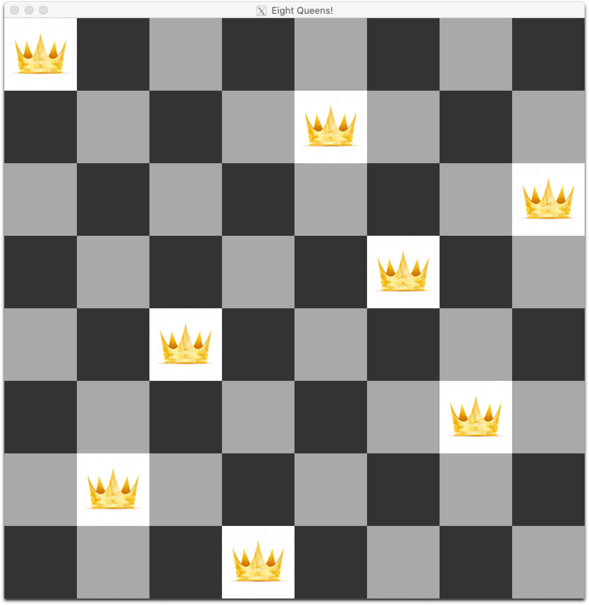

#  CSCI 1103 Computer Science I Honors

## Fall 2020

Robert Muller - Boston College

---

## Lecture Notes DRAFT

## Week 11: Working with 1D and 2D Arrays

**Topics:**

1. Backtrack Search in 8-Queens
2. Zooming Bitmaps 
3. Array & Block Allocation
4. Dictionaries

---

## 1. Backtrack Search in 8-Queens

See the code in `src/queens`.

## 2. Zooming Bitmaps

See the code in `src/zoom`.

## 3. Array & Block Allocation

See the slides in `slides/` and see the code in `src/storage/`.

## 4. Dictionaries

See the slides in `slides/` and see the code in `src/dictionaries/`.

